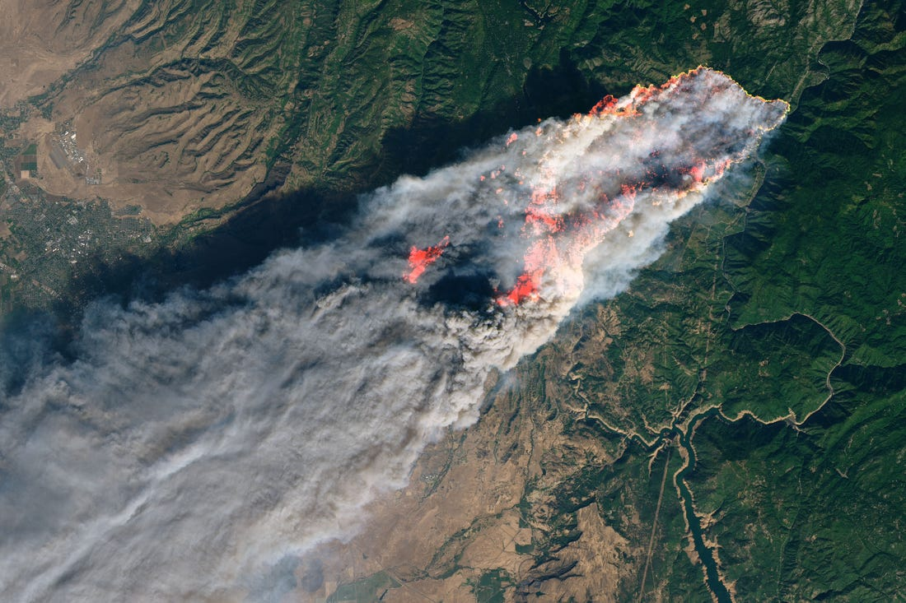
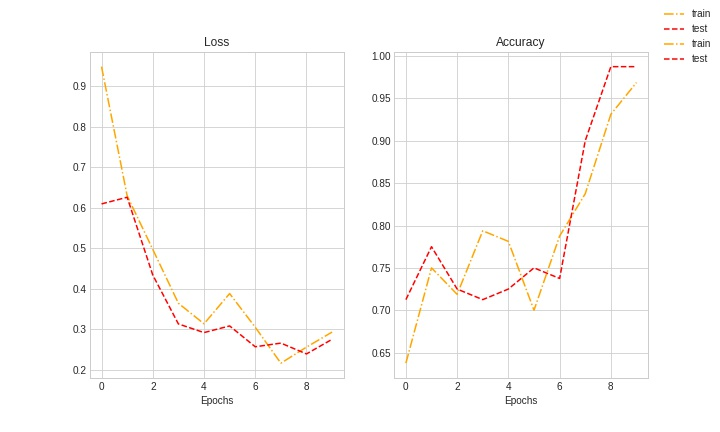

**********************************************
# Forest Fire Detection
**********************************************

#### Author: Chelsea Zaloumis
#### Galvanize DSI Capstone 2
*Last update: 8/22/2020*



# Background & Motivation

Today (8/22/2020), 92 forest fires are burning on approximately 1.5 million acres in 13 states. There are currently more than 24,000 wildland firefighters assigned and distributed to tackle these incidents according to The National Interagency Fire Center. Forest fires are not only destructive and dangerous, but their impact lingers with unhealthy air quality. 

The past two weeks left many states in smoke and I was encouraged to begin data science exploration into fire detection and eventually fire prediction. My goal in this project is to create a convolutional neural network to accurately identify forest fires from images.

# Data

Kaggle fire images dataset: https://www.kaggle.com/phylake1337/fire-dataset
 * 2 folders
 * fireimages folder contains 755 outdoor-fire images some of them contains heavy smoke
 * non-fireimages folder contains 244 nature images (eg: forest, tree, grass, river, people, foggy forest, lake, animal, road, and waterfall)

# Image Preprocessing

The two classes are very imbalanced and the dataset overall is quite tiny, so I generated (resources > gen_images.py) additional images bringing my total dataset to 1,630 'fire' images and 1,525 'not fire' images using the datagenerator below. The images below are examples of what comprised my dataset.

 
 
 # A not so *hot* CNN Model
 
Following this blog post: https://blog.keras.io/building-powerful-image-classification-models-using-very-little-data.html I created ImageGenerators for training and testing images using the flow from directory method.

I organized my data folders from:

        * fire
        * not fire
        
 to:
 
       * train         ->       fire & not fire
       * val           ->       fire & not fire
       * test          ->       fire & not fire
 

I then trained the following neural network (resources > cnn_model1.py) which overfit to my training data (shown below in the high training accuracy).

 ```
    model = Sequential()
    model.add(Conv2D(32, (3,3), input_shape=(256, 256, 3))) 
    model.add(Activation('relu'))
    model.add(MaxPooling2D(pool_size=(2,2)))

    model.add(Conv2D(32, (3,3)))
    model.add(Activation('relu'))
    model.add(MaxPooling2D(pool_size=(2,2)))

    model.add(Conv2D(64, (3,3)))
    model.add(Activation('relu'))
    model.add(MaxPooling2D(pool_size=(2,2)))

    model.add(Flatten())
    model.add(Dense(64))
    model.add(Activation('relu'))
    model.add(Dropout(0.8))
    model.add(Dense(64))
    model.add(Activation('relu'))
    model.add(Dropout(0.5))
    model.add(Dense(1))
    model.add(Activation('sigmoid'))
    
    model.compile(loss='binary_crossentropy',
                optimizer='adam',
                metrics=['accuracy'])
```
 
 
 
Deep neural networks are prone to overfit on training data, and neural network ensembles are arguably the best cure to overfitting. However a quicker, cheaper, and very effective alternative method is to simulate having a large number of different network architectures by randomly dropping out nodes during training i.e. DROPOUT. When you apply dropout to a layer it randomly drops out (by setting the activation to zero) a number of output units from the layer during the training process. Dropout has one input in the form of a float that represents the fraction of output units to randomly drop from the applied layer. Increasing the dropout from 0.5 to 0.8 yielded a model that wasn't overfitting but performed poorly. Evaluating this model on hold-out images resulted in accuracy no better than flipping a coin/guessing. I realized something was wrong with my images...  

 

Model evaluated on unseen hold-out images results:

        Loss: 2.1768    Accuracy: 0.5000

Inspecting my newly constructed train, test, and val folders, I found the test and val *fire* subfolders filled with *non fire* images! This was a small err on my part that led to my model not understanding what it was detecting. Whoops...
 <p align="center">
 
 </p>

# A *HOT* CNN Model

After emptying the *non fire* images from my *fire* folders and filling them randomly with fire images, I built a new neural network (src > cnn_fire.py), not all that different from the first model except for the addition of three more dropout layers (0.5) after each convolutional 2D layer.
 <p align="center">
 
 </p>
This new model predicted beautifully with several runs reaching a validation accuracy of 98%. Below is the model evaluated on unseen hold-out images:

 

        Loss: 0.2823    Accuracy: 0.9619
 
This is better illustrated when we look at the images it was fed and compare it's prediction. Although there's only 6 images displayed, they accurately illustrate images that are easy to classify vs. the one image the model did not classify correctly. The image the model couldn't detect fire in has a small area of fire with plenty of smoke. In comparison to the other 'non-fire' images, it looks very similar to fog.

 

# Overcoming Challenges with a new Data Generator

While training my new HOT model, I received warnings of "Shuffle Buffer" that notified me between epochs of each buffer being shuffled/filled. This was taking my computer up to an hour to run 10 epochs. After some research, I came to the understanding that my ImageGenerator objects were reshuffling my entire dataset (~3,000 images) between each epoch which is very taxing on a computer. The solution is setting a shuffle, and prefetching data with the first epoch. ImageGenerators are not capable of this however the 'image_dataset_from_directory' generating method is!

Following this Tensorflow tutorial: https://www.tensorflow.org/tutorials/images/classification

I defined new train and test data generators to bypass saving image arrays to my local computer and the shuffling problem I was having. 'image_dataset_from_directory' outputs a data.Dataset object which is VERY easy to work with and I highly recommend it for anyone looking to generate data for a neural network. Some quick pointers:

  * .cache() keeps the images in memory after they're loaded off disk during the first epoch.
  * .prefetch(buffer_size) overlaps data preprocessing and model execution while training. Takes parameter 'buffer_size' that represents the max number of elements to be buffered with prefetching. 
    i.e. I am creating a buffer of AT MOST 'buffer_size' images, and a background thread to fill that buffer in the background
  * .shuffle() handles datasets that are too large to fit in memory and shuffles the amount of elements taken as its parameter.
    * large shuffle > dataset   =>   uniform shuffle
    * small shuffle = 1   =>  no shuffling

It's important to shuffle your filenames & labels in advance OR ensure you are shuffling a number of images greater than the amount in any of your classes. 

AUTOTUNE will automatically tune performance knobs on tf.data.experimental.OptimizationOptions(). So when using tf.data objects, tf.data builds a performance model of the input pipeline and uses these OptimizationOptions() to allocate CPU. tf.data builds a performance model of the input pipeline and runs an optimization algorithm to find a good allocation of its CPU budget across all tunable operations. It also tracks the time spent on these operations to further optimize!

```
 AUTOTUNE = tf.data.experimental.AUTOTUNE
 X_train = X_train.cache().shuffle(1000).prefetch(buffer_size=AUTOTUNE)
 X_test = X_test.cache().prefetch(buffer_size=AUTOTUNE)
```
 <p align="center">
 
 </p>

 

Anywho... same model. WAY faster. No shuffle buffering. 98% validation accuracy. DOUBLE BAM.
